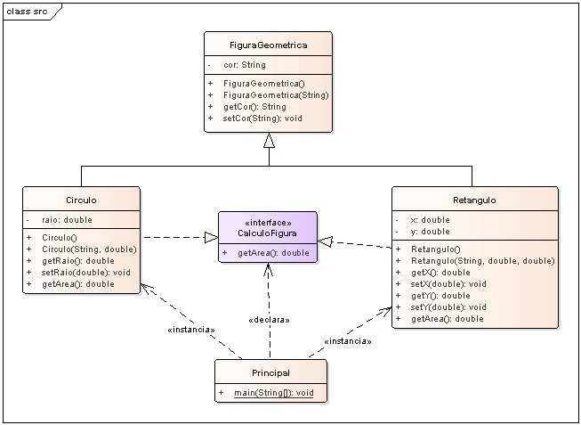

# Exemplo de polimorfismo em Java utilizando interface.

## Contextualização

Exemplo de implementação de polimorfismo em Java utilizando interface.
O projeto modela as classes referentes a objetos geométricos Triângulo e Círculo.
Para estes objetos geométricos necessitam de algumas características como cor e dimensões e uma operação para calcular sua área.
Deseja-se conhecer a área total das figuras mantidas no conjunto.
Existe a possibilidade do surgimento de novos tipos de figuras, portanto o conjunto deve ser extensível.
O programa Principal usa objetos da classe Triângulo e Círculo através da interface FiguraGeometrica.

## Diagrama de classe

